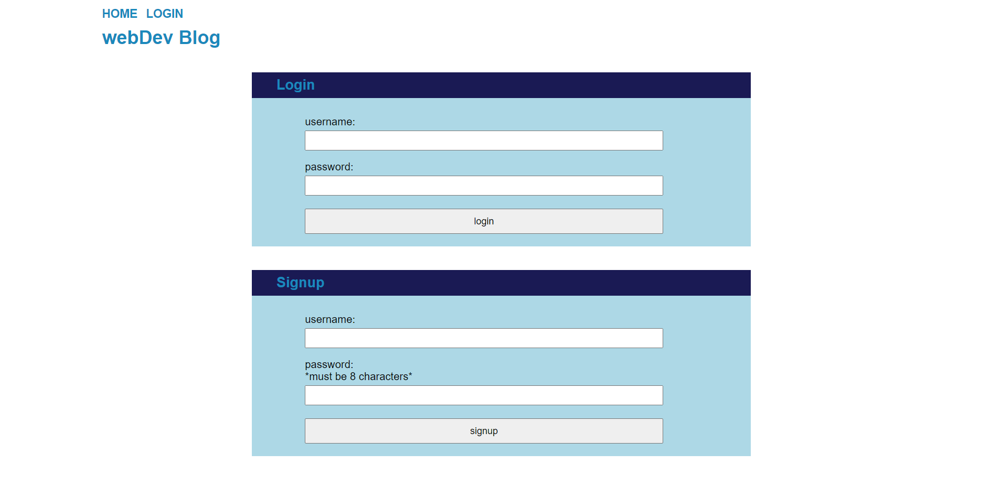
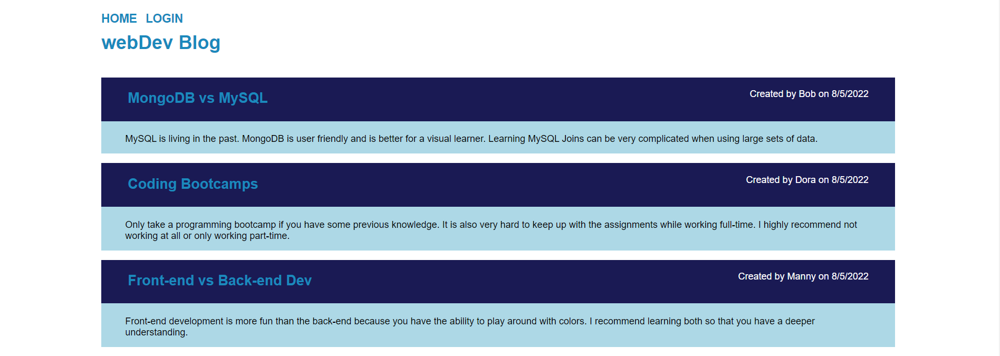
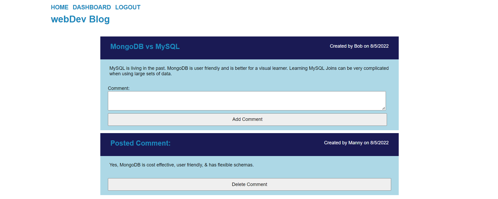
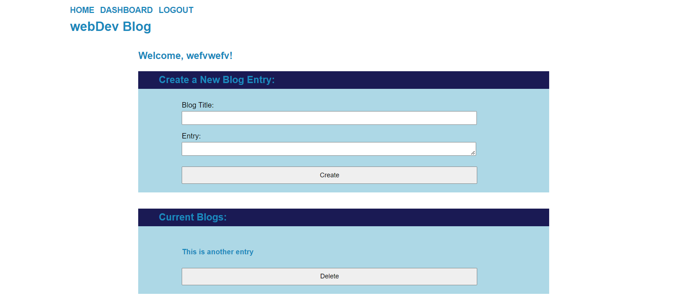

# MVC: WebDev Blog

## Description

A CMS-style blog site similar to a Wordpress site, where developers can publish their blog posts and comment on other developers’ posts as well. This site completely from scratch and it is deployed to Heroku. The app follows the **Model View Controller (MVC)** paradigm in its architectural structure, using Handlebars.js as the templating language, Sequelize as the ORM, and the express-session npm package for authentication.

## Deployed Heroku URL:  

[Heroku working without seeds](https://stark-river-94686.herokuapp.com/project/1) But all the seeds do work and they were working on MySQL Workbench.

[Heroku Not working launched with JAWS](https://enigmatic-spire-21742.herokuapp.com/)

## Installation

[express-handlebars](https://www.npmjs.com/package/express-handlebars) The application’s folder structure follows the Model-View-Controller paradigm by using the handlebars package.
```
npm install express-handlebars
```

[MySQL2](https://www.npmjs.com/package/mysql2) 
```
npm install --save mysql2
```

[Sequelize](https://www.npmjs.com/package/sequelize) packages to connect to a MySQL database for your Models, and create an Express.js API for your Controllers.
```
npm i sequelize
```

[dotenv package](https://www.npmjs.com/package/dotenv) to use environment variables.
```
npm install dotenv --save
```

[bcrypt package](https://www.npmjs.com/package/bcrypt) to hash passwords.
```
npm install bcrypt
```

[express-session](https://www.npmjs.com/package/express-session) **Note**: The package stores the 
session data on the client in a cookie. When you are idle on the site for more than a set time, the 
cookie will expire and you will be required to log in again to start a new session. This is the 
default behavior and you do not have to do anything to your application other than implement the npm
package.
```
npm install express-session
```

[connect-session-sequelize](https://www.npmjs.com/package/connect-session-sequelize) packages to add authentication.
```
npm install connect-session-sequelize
```

## Usage
Create .env file
```
DB_NAME= `your database name`
DB_USER=root
DB_PASSWORD= `your mysql password`
```

Start MySQL and enter your Password
```
mysql -u root -p
```

Exit mysql and go to Terminal
```
Exit
```

Run Seeds
```
node seeds/seed.js or npm run seed
```

Start Program
```
Node server.js or npm start
```

## Items Completed

✅CMS-style blog site

✅The homepage includes existing blog posts if any have been posted; navigation links for the homepage and the dashboard; and the option to log in.

✅When the homepage option is clicked the user is taken to the homepage.

✅When the links in the navigation are clicked the user is prompted to either sign-up or sign-in.

✅When the sign-up is chosen the user is prompted to create a username and password.

✅When the sign-in is chosen the user is prompted to enter the username and password and can log into the site.

✅There are navigation links for the homepage, the dashboard, and the option to log-out.

✅On the homepage once logged-in the homepage includes existing blog posts that include the post title and the date created.

✅When the user clicks on the existing blog post the user is presented with post tile, contents, post creator's username, and the date created. There is also an option to leave a comment.

✅The user can leave a comment and click on the submit button and the comment is saved and the post is updated to display the comment, the comment creator’s username, and the date created.

✅When the dashboard is clicked option the user is taken to the dashboard and presented with any blog posts that have already been created and the option to add a new blog post.

✅When the button to add a new blog post has been clicked, the user is prompted to enter both a title and contents for the blog post and they are saved.

✅The user is able to delete or update the post and taken back to an updated dashboard.

✅The user has an option to logout when signed into the site.

✅The user can only stay on the site for a certain amount of time being idle and the user must log back in before they can add, update, or delete comments.

## Screenshot





- - - 
[](https://opensource.org/licenses/MIT)
